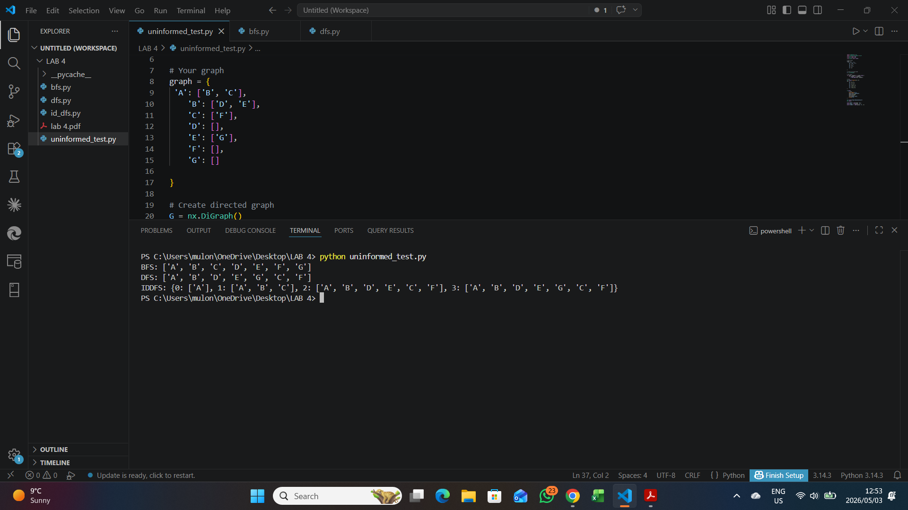
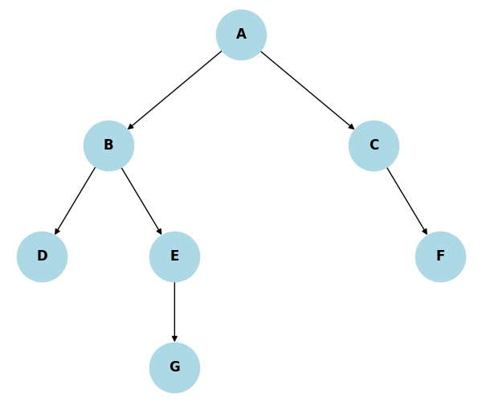

# Graph Search Algorithms in Python

A professional artificial intelligence project implementing core uninformed search algorithms for graph traversal. The project demonstrates Breadth-First Search, Depth-First Search, and Iterative Deepening Depth-First Search using a directed graph with visual output.

## Project Overview

Search algorithms are fundamental to artificial intelligence, route planning, decision systems, and problem solving. This project compares different uninformed search strategies by applying them to the same graph structure and showing how each algorithm explores nodes.

Implemented algorithms:

- Breadth-First Search
- Depth-First Search
- Iterative Deepening Depth-First Search
- Directed graph visualization

## Repository Structure

```text
graph-search-algorithms-python/
├── assets/
│   └── screenshots/
│       ├── command-output.png
│       └── graph-visualization.png
├── src/
│   ├── bfs.py
│   ├── dfs.py
│   ├── iterative_deepening_dfs.py
│   └── search_demo.py
├── requirements.txt
├── .gitignore
└── README.md
```

## Technologies Used

- Python
- NetworkX
- Matplotlib
- Graph Theory
- Artificial Intelligence Search

## Installation

Clone the repository and install dependencies.

```bash
git clone https://github.com/mulondimbodi/graph-search-algorithms-python.git
cd graph-search-algorithms-python
pip install -r requirements.txt
```

## Usage

Run the search demonstration script:

```bash
python src/search_demo.py
```

The script will:

- Build a directed graph
- Display the graph visualization
- Run BFS from node `A`
- Run DFS from node `A`
- Run IDDFS from node `A` up to depth 3
- Print traversal results in the terminal

## Algorithm Comparison

| Algorithm | Strategy | Best Use Case |
| --- | --- | --- |
| BFS | Explores level by level | Finding shortest path in unweighted graphs |
| DFS | Explores deeply before backtracking | Memory-efficient traversal and path exploration |
| IDDFS | Repeated depth-limited DFS | Combines DFS memory efficiency with BFS completeness |

## Results

### Command-line output



### Graph visualization



## AI and Data Science Relevance

This project demonstrates practical AI and analytical programming skills including:

- Implementing search algorithms from first principles
- Representing graph data structures in Python
- Visualizing directed graph relationships
- Comparing traversal strategies
- Building reproducible algorithm demonstrations
- Communicating algorithm behavior through visual and terminal outputs

## Future Improvements

- Add pathfinding between selected start and goal nodes
- Add Uniform Cost Search and Bidirectional Search
- Include runtime and memory complexity comparisons
- Add automated tests for each algorithm
- Build an interactive graph search dashboard

## Author

Created by Mulondi Mbodi as part of a professional Artificial Intelligence and Data Science portfolio.
